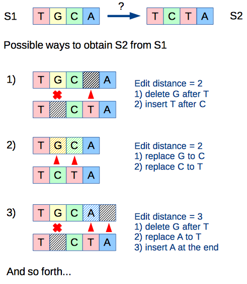
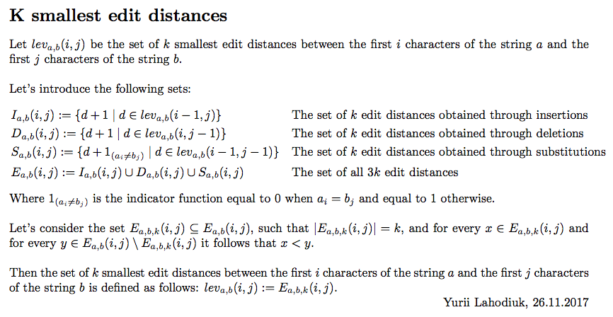
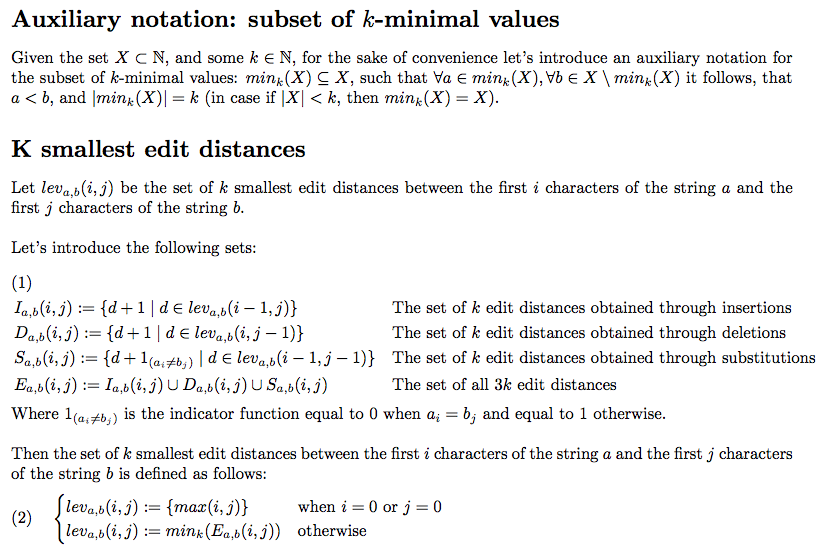
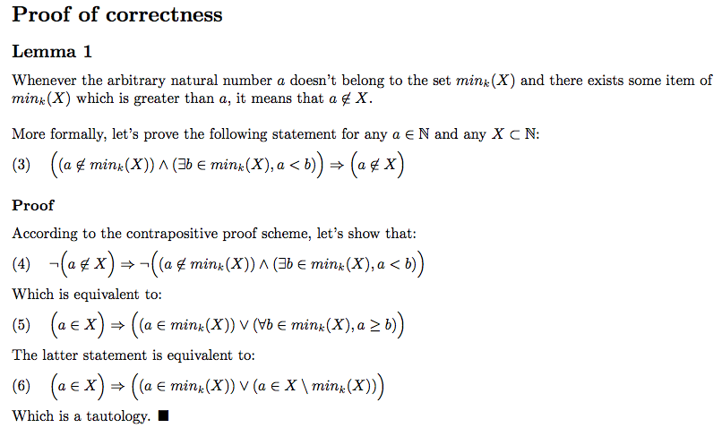
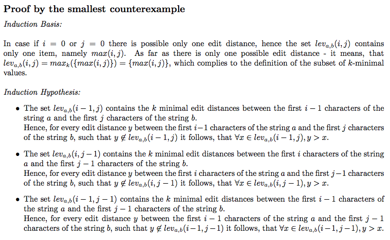
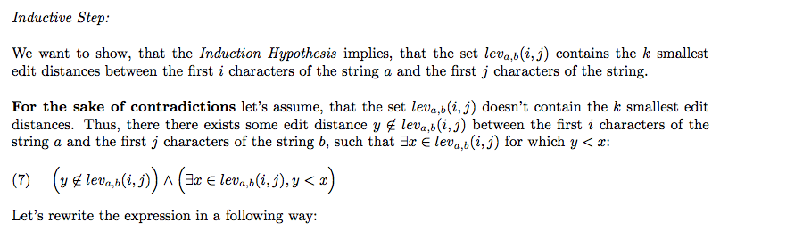
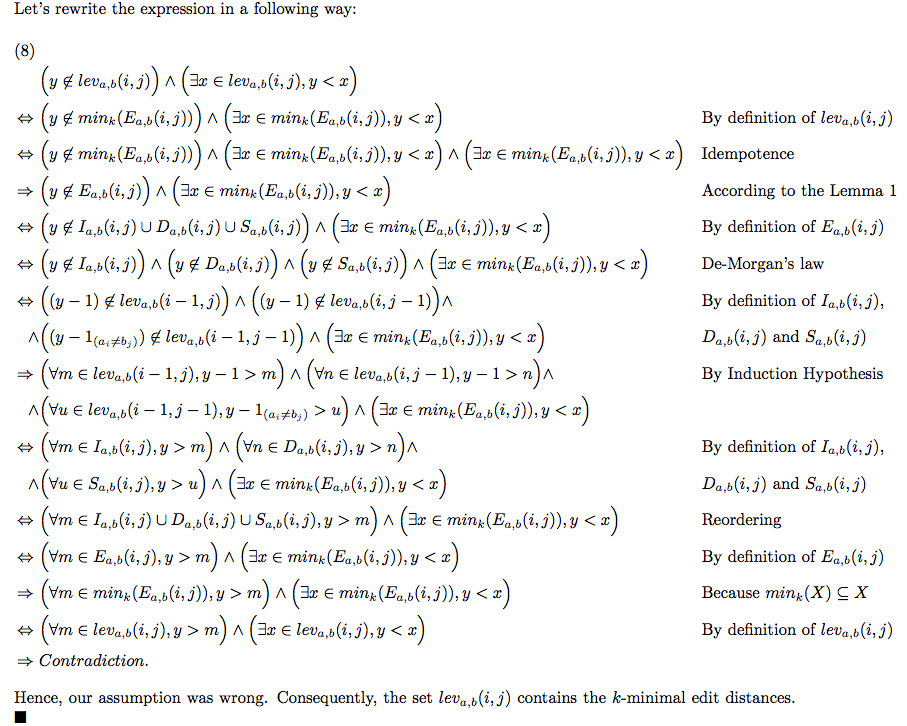

# levenshtein-top-k

In many applications of the sequence alignment techniques there is an assumption, that the difference between two compared sequences is a result of the minimal amount of the edit operations (thus the calculation of the minimal edit distance is used). However, in some cases there might be a need to analyze the certain amount of the possible sequence alignments (top-K alignments in the order of increase of the edit distance). Thus, the presented algorithm helps to tackle the latter use case.



The presented algorithm, finds the top-K different string alignments with the shortest edit distances among other possible alignments (based on the Levenshtein distance definition).
Below is a short description of the algorithm, which complies with the terminology of the standard Levenshtein distance algorithm: https://en.wikipedia.org/wiki/Levenshtein_distance



Let's denote `M` as the length of the input string `s1`, and `N` is the length of the input string `s2`.
Then, the runtime complexity of the algorithm is `O(N*M*K + K*log(K))` or `O(N*M*K*log(K))` (depending on the implementation of the supplementary procedure for selection of the `K` smallest elements of an array).

The implementation of the algorithm is in the file: [src/main/java/com/lahodiuk/levenshtein/topk/LevenshteinTopK.java](src/main/java/com/lahodiuk/levenshtein/topk/LevenshteinTopK.java)

The demonstration of the algorithm is in the file: [src/main/java/com/lahodiuk/levenshtein/topk/Demo.java](src/main/java/com/lahodiuk/levenshtein/topk/Demo.java)

Example of input:
```text
s1 = "TGCA"
s2 = "TCTA"
K = 10
```

Example of output:
```text
Total amount of results: 10

=======================================

Edit distance:2
s1 aligned: TGC_A
s2 aligned: T_CTA
common str: T_C_A

=======================================

Edit distance:2
s1 aligned: TGCA
s2 aligned: TCTA
common str: T__A

=======================================

Edit distance:3
s1 aligned: TGCA_
s2 aligned: T_CTA
common str: T_C__

=======================================

Edit distance:3
s1 aligned: TG_CA
s2 aligned: TCT_A
common str: T___A

=======================================

Edit distance:3
s1 aligned: T_GCA
s2 aligned: TCT_A
common str: T___A

=======================================

Edit distance:3
s1 aligned: TGC_A
s2 aligned: TC_TA
common str: T___A

=======================================

Edit distance:3
s1 aligned: TGC_A
s2 aligned: _TCTA
common str: __C_A

=======================================

Edit distance:3
s1 aligned: T_GCA
s2 aligned: TC_TA
common str: T___A

=======================================

Edit distance:3
s1 aligned: TG_CA
s2 aligned: T_CTA
common str: T___A

=======================================

Edit distance:4
s1 aligned: TGC__A
s2 aligned: T_CTA_
common str: T_C___
```
## Proof of correctness

The whole proof is in the [levenshtein_top_k.pdf](levenshtein_top_k.pdf)






